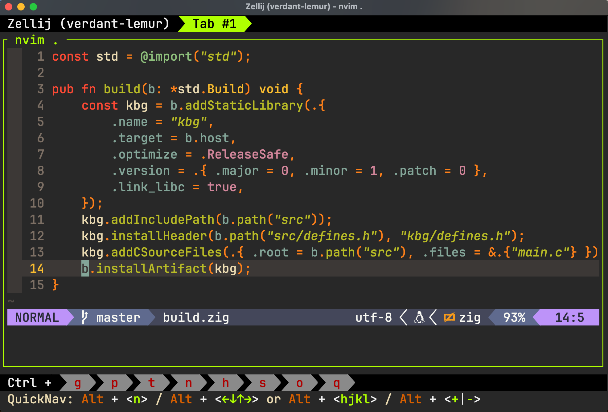
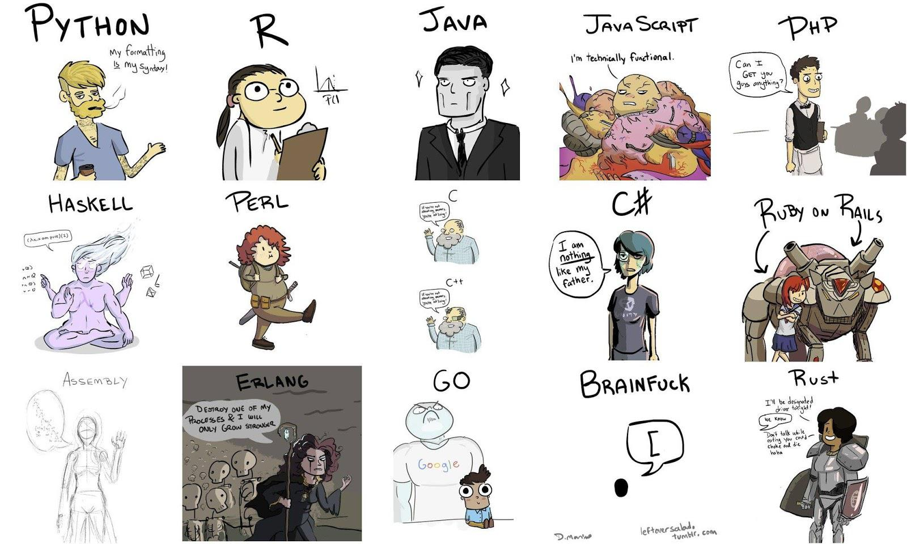

:::note
This post was originally published at [medium](https://medium.com/@ishankbg/what-is-programming-3acda73649ca)
:::

Before knowing what is programming you must know the what are computers and how they work.

I know that most of you know what are computers and you are actually using it to read this article.

If I say in simple words computers are just machines performing arithmetical and logical operations for you. Computers run programs which contains some sets of instructions to perform different tasks for you and programming is a process of writing set of instructions to tell computer to perform certain task. For example imagine you are trying to make a cake and to make it you have to follow some sort of instructions.

Those instructions must be in an arranged and sequenced manner else your cake will not become as you want to be as you can’t add eggs after baking. Making a cake is a same as writing programs as you have to write each and every piece of code in an arranged and sequenced manner in order to make it work as intended.

### Should I learn programming ?

This type of question has multiple answers, it depends on the person who is willing to either learn it or not. For some people programming is just a job, for some it’s only business or money and for some people it’s a grand passion of their life. Some want to learn programming so that they can stimulate robotic hands, for some it’s game development and for some it’s web development. It depends on where and how you want to apply programming skills. So ask this question to you and you will find the answer

Some might ask that why did I learn programming and my answer is that I have always been intrigued by computers and thought of them as a means to bridge the gap between countries and entire continents, allowing people from various communities to communicate with each other, I was fascinated by how it all worked and so I decided to pursue Programming as my career choice

### What programming language should I learn ?

> The only way to learn a new programming language is by writing programs in it.
>
> <cite>- Dennis Ritchie</cite>

I am going to say the same thing as I said above that this type of question has multiple answers, it depends in what things you want to implement programming.

**Web Development:** You can use JavaScript, Html and CSS to make an interactive website and then use Nodejs as it’s back-end.

**Game Development:** You can use C# or C++ for developing both 2d and 3d games .

**Automation and Scripting**: You can use Bash, JavaScript or Python for automating your workflow.

**Android Development:** You can use Java or Kotlin to make robust and interactive android applications.

There are many more things in which you can use different programming languages. If you want to start your journey then there are many free resources available on internet such as [codecademy.com](http://codecademy.com), [pluralsight.com](http://pluralsight.com), [freecodecamp.org](http://freecodecamp.org), etc.
